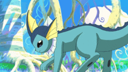

# My First Coding Assignment

## About Me
Hi, I'm Arwen! I'm currently a graduate student at the University of Florida, pursuing a Master's in Mass Communication with a focus in Web Design and Online Communication. I graduated with my Bachelor's degree in Computer Science from UF in May 2025. My passions include music (I love to sing and play piano, and I was involved in UF Choir and the Gator Marching Band), the ocean, cats, and Pokémon. My main hobby is playing Pokémon Go, as I'm involved with the UF Pokémon Go Players club as a Niantic Community Ambassador.

## Past Coding Experience
As a Computer Science major in my Bachelor's program, I was exposed to several coding languages and learned a diverse range of coding skills and concepts. The languages I'm most familiar with are C++, Java, and Python. I've used HTML, JavaScript, and CSS sparingly but I'm not very experienced with them. Those front-end coding languages are the main languages I'm interested in learning and becoming proficient in.

## Career Goals
1. Get an internship in the web design or UX field
2. Become proficient in front-end coding languages (JavaScript, HTML, CSS)
3. Become proficient in UX technical skills (like prototyping, wireframing, user testing, and user research)
4. Build a strong portfolio
5. Get a job within the web design or UX field